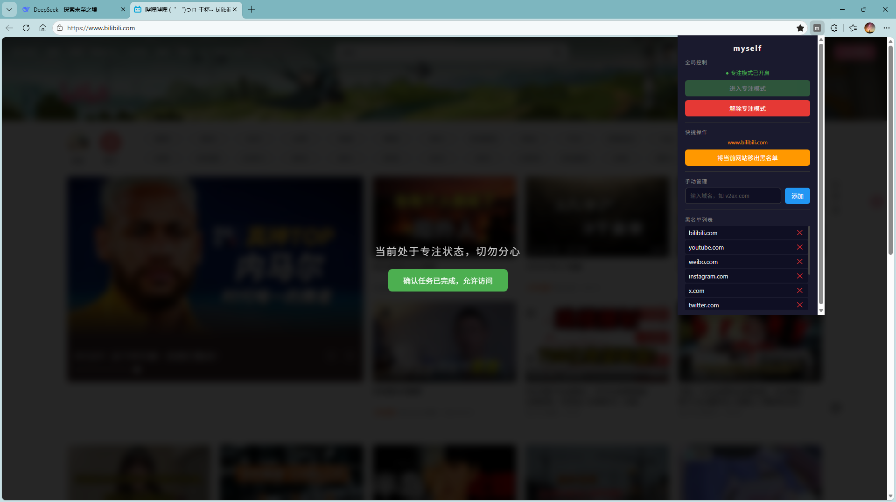

# Myself - 极简浏览器防分心插件

> 一个基于 Manifest V3 的轻量级浏览器扩展，通过“动态可扩展黑名单”机制，在学习和深工作时提供软性阻力，夺回你的注意力。

## 💡 设计理念

防分心工具的核心目的，是阻断基于“肌肉记忆”的无意识切换，而不是打造一个绝对隔离的断网牢笼。
**Myself** 采用动态黑名单而非白名单策略，确保你在查阅技术文档、使用搜索引擎或 AI 工具时享受 **0 干扰** 的丝滑体验，仅在无意识打开娱乐网站时给予全屏遮罩拦截。

## ✨ 核心特性

- **☯️ 极简专注模式**：一键开启/解除专注状态，状态跨标签页实时同步。
- **🛡️ 动态可扩展黑名单**：告别繁琐的配置。内置 B站、YouTube、Twitter 等高危娱乐域名库。
- **⚡ 一键拉黑/放行**：发现新的分心网站？点击插件图标，一键将当前网页加入或移出黑名单。
- **🚀 生产力零干扰**：非黑名单域名直接放行，底层不执行任何 DOM 操作，对系统性能零消耗。
- **🔒 绝对隐私**：纯本地运行，所有数据基于 `chrome.storage.local` 存储，无任何外部网络请求，不收集任何用户隐私。

## 🛠️ 技术栈

- HTML / CSS / Vanilla JavaScript
- Chrome Extensions API (Manifest V3)
- **无任何前端框架及第三方依赖**，纯原生开发，极致轻量。

## 📦 安装指南 (本地开发者模式)

本项目完全兼容基于 Chromium 内核的现代浏览器（如 Google Chrome, Microsoft Edge, Brave 等）。

1. 将本仓库克隆到本地，或点击 `Code -> Download ZIP` 并解压。
   ```bash
   git clone [https://github.com/你的用户名/Myself.git](https://github.com/你的用户名/Myself.git)

2. 打开浏览器的扩展管理页面：
* Chrome: 访问 `chrome://extensions/`
* Edge: 访问 `edge://extensions/`

3. 开启页面右上角的 **开发者模式 (Developer mode)**。

4. 点击 **加载已解压的扩展程序 (Load unpacked)**，选择刚刚克隆/解压的 `myself` 文件夹即可。

## 🎮 使用说明

1. **开启专注**：在准备深度工作前，点击浏览器右上角的 `myself` 插件图标，点击“进入专注模式”。
2. **遭遇拦截**：若此时访问黑名单中的网站，页面将被全屏毛玻璃遮罩拦截。
3. **解除拦截**：若确实需要访问，可点击遮罩上的按钮，即可全局解除专注状态。
4. **管理黑名单**：
* 在任何网页中打开插件面板，可直接看到“一键拉黑当前网站”或“移出黑名单”的快捷操作。
* 也可在面板的输入框中手动输入域名（如 `v2ex.com`）进行添加。
* 面板底部提供当前完整黑名单列表的可视化管理。


## 📄 开源协议

本项目基于 [MIT License](https://www.google.com/search?q=LICENSE) 开源，你可以自由地使用、修改和分发。

